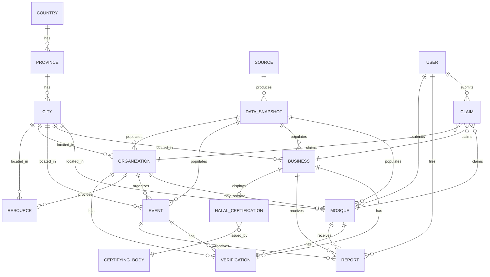
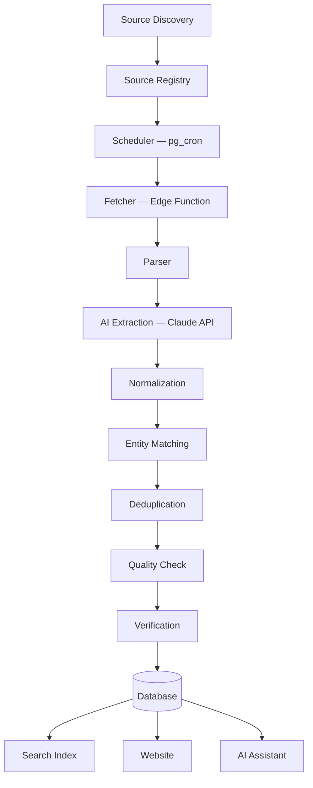

# MuslimsInCanada.com — Phase 4: Technical & Data Architecture

*This is the production blueprint Phase 5 gets built from. Every choice below is scoped to what a solo/small-team, bootstrapped build (per Phase 0) can actually operate — not the biggest possible stack, the right-sized one, with an explicit upgrade path noted wherever MVP-scale and future-scale diverge.*

---

## 1. Stack Overview & Rationale

| Layer | Choice | Why |
|---|---|---|
| Frontend | **Next.js (React), deployed on Vercel** | Already the hosting platform in place; Next.js gives server-rendered pages (critical for SEO — mosque/business/event pages need to be crawlable, per the Phase 2 SEO goals) plus API routes in one deployable, which matches a solo-team's need to minimize moving parts |
| Database | **Postgres via Supabase** (already connected to this project) | One database does double duty: relational integrity for the directory/event/org data model, **PostGIS extension for geo queries** ("near me," map bounding-box search), and **pgvector** available later for AI-assistant semantic search — no need for a separate geo or vector database at this scale |
| Auth | **Supabase Auth**, used narrowly at MVP | Matches the locked "no-login submissions" decision — Supabase Auth only gates the admin/moderation side at MVP; public submission uses email-verification tokens, not full accounts. Real user accounts (Phase 2) reuse the same system rather than bolting on a second one |
| Search | **Postgres full-text search + PostGIS at MVP**, not a dedicated search service | At GTA-only, low-thousands-of-listings scale, a dedicated search engine (Elasticsearch/Meilisearch/Algolia) is premature infrastructure — Postgres FTS combined with trigram matching handles typo-tolerant keyword search, and PostGIS handles geo, without adding an operational dependency. **Upgrade trigger:** once listings cross roughly 50–100K rows or multi-city semantic search becomes central, migrate to Meilisearch (self-hostable, cheap) or pgvector-based semantic search — flagged now so it's not a surprise rebuild |
| Background jobs / scheduling | **Supabase Edge Functions + pg_cron**, not a separate worker fleet | Vercel's serverless functions aren't built for long-running scheduled scraping jobs; pg_cron (built into Supabase Postgres) can trigger Edge Functions on a schedule, keeping the whole stack inside two platforms (Vercel + Supabase) instead of adding a third (e.g., a standalone Railway/Render worker) before there's a real reason to |
| AI (extraction + assistant) | **Claude API (Anthropic)** | Used for two distinct jobs: (a) structured extraction from fetched pages/feeds during ingestion, (b) the grounded "Ask MuslimsInCanada" assistant, using retrieval against the platform's own Postgres data — never open-web generation for user-facing answers |
| Storage | **Supabase Storage** | Mosque/business photos, org logos — same platform as the database, one less vendor |
| CDN / caching | **Vercel's edge network** (built in) | Next.js static/ISR pages are cached at the edge automatically; no separate CDN needed at this scale |
| Monitoring/logging | **Vercel Analytics + Supabase's built-in logs/advisors**, plus a lightweight custom `event_log` table for product analytics | Avoid standing up a separate observability stack (Datadog-class tooling) before there's traffic that justifies it |
| Deployment | **GitHub → Vercel auto-deploy** (already set up by Claude Code) | Every push to `main` deploys automatically; this is the existing pipeline, Phase 4 just formalizes it |

**Explicit non-choices, and why:** no Elasticsearch/dedicated search cluster at MVP (cost/ops overhead unjustified at this scale), no separate microservices architecture (a monolith-with-a-clean-internal-structure is the right call for a small team — splitting services prematurely is a classic over-engineering trap), no Kubernetes/container orchestration (Vercel + Supabase are both managed platforms — there's no fleet to orchestrate yet).

---

## 2. Geographic Architecture

A real `location` hierarchy table set, not string fields on each listing — this is the schema-level version of the Phase 2 "don't hardcode GTA-only" principle:

```
country (id, name, code)
province (id, country_id, name, code)
city (id, province_id, name, slug, lat, lng, is_launched boolean)
neighbourhood (id, city_id, name, slug)  -- optional granularity, GTA municipalities (Mississauga, Brampton, etc.) modeled as cities, not neighbourhoods, since they have their own identity
```

Every listing (mosque, business, event, organization, resource) stores a `location_point` (PostGIS `geography(Point)`) plus a foreign key to `city_id` — the point enables radius/"near me" queries, the city FK enables the city-hub page queries without a spatial calculation every time. `is_launched` on `city` is how the app knows to show a full city hub vs. a "coming soon" placeholder — this is how Phase 3's city-by-city rollout is actually implemented, not hardcoded per-city routes.

---

## 3. Core Data Model



**Every content entity (Mosque, Business, Event, Organization, Resource) shares a common set of provenance fields** — this is the single most important schema decision in this document, since it's what makes the trust/freshness system in Phase 3 actually real rather than cosmetic:

```
source_id            -- FK to Source (which registry entry produced this)
data_snapshot_id      -- FK to the specific fetch/extraction that last touched this record
confidence_score       -- 0-1, set by the quality-check stage
verification_status    -- NEW | VALIDATING | VERIFIED | PUBLISHED | MONITORED | STALE | RECHECKING | EXPIRED
last_verified_at
last_source_change_at
claim_status          -- unclaimed | pending | claimed
```

**Source registry** (the thing every ingestion job is driven by):
```
source (id, name, type[osm|cra|ical|schema_org|manual|community], url, fetch_frequency,
        last_fetch_at, last_success_at, last_error, reliability_score, requires_attribution boolean)
```

**Conflict resolution** is modeled explicitly rather than resolved silently: when two sources disagree on a field (e.g., Jumu'ah time), both values are stored on the `data_snapshot` history, and the currently-displayed value is chosen by source-priority (organization-verified > official org website/feed > CRA/OSM seed > community-submitted > AI-inferred) — the source-priority list itself lives in config, not hardcoded logic, so it can be tuned without a redeploy.

---

## 4. The Community Data Aggregation Engine

This is the differentiator from Phase 0/1 made concrete. Every stage below is a real, separately testable step — not a single "scraper script."



**Source Discovery** — at MVP, mostly manual/researched (this is exactly what Phase 1 did for OSM/CRA); a lightweight internal tool lets the admin register a new source (a mosque's iCal URL, a newly found CRA entry) rather than requiring a code change.

**Source Registry** — the `source` table above; every fetch job reads its schedule from here, not from a hardcoded cron list.

**Scheduler** — `pg_cron` triggers Edge Functions on a per-source cadence, matched to how often that source type actually changes: OSM/CRA (bulk, low-change) weekly; iCal feeds daily; nothing runs more often than its data plausibly changes, to avoid wasting the AI-extraction budget on unchanged content (a real cost control, not just tidiness).

**Fetcher** — pulls raw content (Overpass API response, CRA CSV row, iCal file, HTML page). Records success/failure back onto the `source` row so the admin's source-health dashboard (Phase 3) is fed by real data, not vibes.

**Parser** — format-specific: iCal → structured events via a standard library (trivial, per Phase 1 finding), CRA CSV → structured rows, OSM → tag-to-field mapping. HTML pages without structured data fall through to AI Extraction directly.

**AI Extraction** — Claude API, used specifically for the unstructured cases (a mosque's "Announcements" page as plain text, an event described in prose) — asked to extract into a strict schema (name, date, location, category) and to **return null rather than guess** when a field isn't confidently present, mirroring the "AI never invents" principle from data ingestion, not just the user-facing assistant.

**Normalization** — dates to a single timezone-aware format, addresses through a geocoding pass (attaches `location_point`), category strings mapped to the platform's fixed taxonomy.

**Entity Matching** — new/updated records are matched against existing ones by a combination of geographic proximity (PostGIS distance) + fuzzy name matching (Postgres trigram similarity) — this is what lets an OSM mosque record and a CRA charity record for the same physical mosque merge into one profile instead of creating duplicates.

**Deduplication** — where entity matching finds a likely duplicate above a confidence threshold, records are merged (keeping the highest-priority source's field values per the conflict-resolution rule above); below threshold, both are queued for human review rather than silently guessed.

**Quality Check** — automated sanity rules (valid address, plausible date, non-empty required fields) assign the `confidence_score`; anything below a threshold routes to the moderation queue instead of auto-publishing.

**Verification** — moves a record through the `verification_status` states; OSM/CRA-seeded records start at `VALIDATING` and can reach `PUBLISHED` automatically if quality checks pass (Phase 1 established these sources are trustworthy enough for this), while community submissions always require a human moderation step before `PUBLISHED`, regardless of the AI's confidence score — this is a deliberate policy, not a technical limitation, matching the Phase 2 finding that manual moderation is core infrastructure.

**Freshness monitoring / expiration** — a scheduled job walks `PUBLISHED` records; anything past its source's expected refresh window moves to `STALE` (shown with a visibly aged freshness badge, not silently hidden) and gets requeued for `RECHECKING`; events auto-move to an archived state after their date passes.

---

## 5. AI Assistant Architecture

Retrieval-augmented, not fine-tuned or open-generation: a user question is parsed for intent/location/category/time (Claude API, structured output), translated into a real Postgres query (with PostGIS for location) against the same tables the website itself renders from, and the answer is generated **only from the retrieved rows**, with each cited by source and freshness date. If the query returns nothing, the assistant says so — this is enforced by prompt design *and* by the fact that there's nothing else to hallucinate from, since it's never given open-web access. Scope-limiting (per Phase 3's "I can currently answer questions about Toronto and Peel Region") is implemented as a query filter, not a suggestion to the model — the underlying data genuinely doesn't include other cities yet, so there's nothing to leak.

---

## 6. Moderation, Security & Privacy

**Moderation:** every community submission and every auto-extracted record below the quality-check confidence threshold lands in one shared queue, triaged by content type and risk (a "closed business" report is lower-stakes than a "reported scam" or a sectarian-dispute flag on a mosque page, and should be visually distinguished in the admin queue). Rate limiting on the public submission endpoint (per IP + per email) is a floor against spam given there's no login wall.

**Authorization:** three tiers — public (read, submit), admin (moderate, manage sources), and (Phase 2) claimed-org owner (edit their own claimed listing only) — modeled as Postgres row-level security policies in Supabase rather than application-layer checks alone, so a bug in the app code can't accidentally expose write access.

**Privacy / institutional safety (carrying forward the Phase 0 North Star principle directly into architecture):** `location_point` precision is reduced for sensitive resource categories (e.g., a women's shelter listed under Resources shows a service area, not an exact point — mirroring the Phase 3 page-spec note); "near me" queries never store the user's precise location server-side, only use it transiently for the query; no analytics event captures which specific mosque a specific user viewed tied to an identifiable account at MVP (aggregate counts only) — this is a deliberate constraint given the real-world risk profile flagged since Phase 0, not a default to relax later without a specific reason.

**Secrets/config:** API keys (Claude, Supabase service role) live in Vercel/Supabase environment config, never in the repo — worth stating explicitly since Claude Code will be the one wiring these up.

---

## 7. Disaster Recovery & Operational Basics

Supabase provides automated daily backups and point-in-time recovery on paid tiers — worth budgeting for once real user-submitted data exists (the coming-soon-page stage doesn't need this yet, but Phase 5's first real data model migration does). Source-registry failures (a feed going dark, a site changing layout and breaking the parser) degrade gracefully: the affected source is marked unhealthy on the admin dashboard rather than silently failing, and previously-published data stays live (marked increasingly `STALE` over time) rather than disappearing the moment a fetch fails once.

---

## Summary: What This Buys

A solo/small-team-operable stack (two managed platforms — Vercel and Supabase — instead of a sprawling infrastructure footprint), a data model where trust/freshness/provenance is structural rather than bolted on, an ingestion engine that's honest about which sources are genuinely automatable (OSM/CRA) versus which require the moderation-backed manual channel Phase 1/2 established as core infrastructure, and an AI assistant that's architecturally incapable of inventing information because it only ever sees what the database actually contains.

---

Next is Phase 5 — the actual build, starting with project foundation, the design system implementation, the database schema, and the source registry. Per the phase gates, I'm stopping here for your review first.
